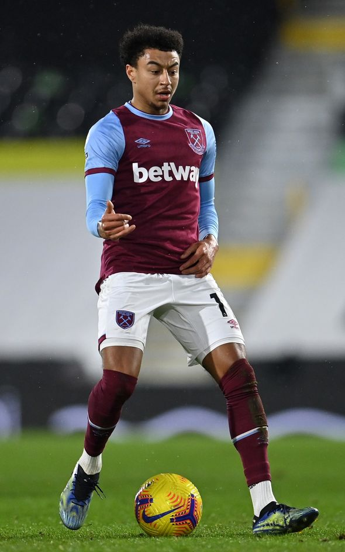

# **_West Hum United-Player Jesse Lingard_** 

Jesse Lingard is 28 years old former Manchester United player. With the Covid-19 existence, his performance decreased and he did not play for his team Manchester United for all most year. His Mother dead becuase of Covid-19 and he took the responsibility of the house. On the other his girl friend left him. The responsibility outside football and online criticism became a big distraction for him to focus in sport. He moved to West Hum United after his position was taken. On West Hum United Club, he showed all his classic performance. He score 8 goals in 9 matches. He was chosen by his notional team England for the World Cup 2021-2022. His confidence seems to be high and proved to the world that he is one of the best foot ball player. 

> It still unclear if he going to make his way back to Manchester Unted or join the big team like barcelona FC, Real Madrid, or PSG.

Additional Achievement: 

 - On 4 August 2014, Lingard came off the bench to score the third goal in United's 3–1 [International Champions Cup Final](https://en.wikipedia.org/wiki/International_Champions_Cup) win over Liverpool. He made his competitive debut for the club in the first match of the 2014–15 Premier League season at home to Swansea City,Jesse Lingard scored FA CUP Final game winning goal against crystal palace FC. 
 - Lingard was born in England, and his paternal grandparents are emigrants from Saint Vincent and the Grenadines. On 29 January 2021, Lingard joined [West Hum United](https://www.whufc.com) on loan until the end of the season. 
  - In May 2018, Lingard was named in the 23-man [England squad](https://englandfc.com) for the 2018 FIFA World Cup. Lingard scored his first ever World Cup goal in a 6–1 victory over Panama during their second group stage match.